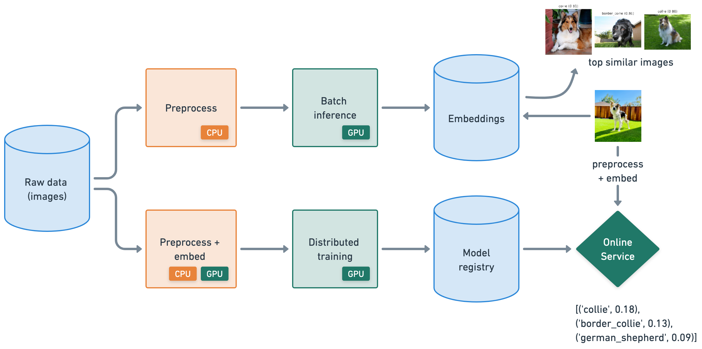

# Foundational Ray Application

&nbsp;
&nbsp;

In this guide, we will learn how to:
- 💡 Create an end-to-end ML application that leverages data processing, batch inference, model training and online serving.
- 📈 Scale out these workloads in a highly distributed manner -- all in Python.
- 💻 Develop these workloads with the compute, dependencies, observability, debugger, etc.
- 🚀 Optimize all of these workloads with RayTurbo ([data](https://docs.anyscale.com/rayturbo/generated/rayturbo-data), [train](https://docs.anyscale.com/rayturbo/generated/rayturbo-train), [serve](https://docs.anyscale.com/rayturbo/generated/rayturbo-serve)) across performance, fault tolerance, scale and observability.
- ✅ Productionize these workloads into batch jobs and online services.

### Overview

In this tutorial, we'll be implementing an application that leverages the following workloads:

- **Data**:
    - distributed data ingestion and preprocessing with [Ray Data](https://docs.ray.io/en/latest/data/data.html)
    - batch inference(heterogenous workloads) to generate embeddings
- **Train**:
    - distributed model training with [Ray Train](https://docs.ray.io/en/latest/train/train.html) and PyTorch
    - save model artifacts to a model registry
- **Serve**:
    - online serving with [Ray Serve](https://docs.ray.io/en/latest/serve/index.html)
    - chain models / processes together and autoscale independently
- **Dev → Prod**:
    - create production batch [Jobs](https://docs.anyscale.com/platform/jobs/) for offline workloads (embedding generation, model training, etc.)
    - create production online [Services](https://docs.anyscale.com/platform/services/) with our trained model

### Workspaces

We're developing our application on Anyscale Workspaces, which enables us to develop without thinking about infrastructure, just like we would on a laptop. Workspaces come with:
- **Development tools**: build with familiar tools like VS Code, Jupyter notebooks, terminal, [distributed debugger](https://docs.anyscale.com/platform/workspaces/workspaces-debugging/#distributed-debugger), [monitoring and debugging](https://docs.ray.io/en/latest/ray-observability/index.html), [unified log viewer](https://docs.anyscale.com/monitoring/accessing-logs/), etc.
- **Compute**: define the compute in our [cluster](https://docs.ray.io/en/latest/cluster/key-concepts.html). This can be from your clouds (multicloud) or our Hosted Anyscale experience.
    - *Head node*: manages the cluster, distributes tasks, and hosts development tools.
    - *Worker nodes*: machines that execute work orchestrated by the head node and can scale up and back down to 0.
- **Dependency management**: define the environment and it's dependendies your workloads neeed.

Learn more about Anyscale Workspaces through the [official documentation](https://docs.anyscale.com/platform/workspaces/).

### Dev → Prod

Once we're done developing, it's extremely fast and easy to take our code, compute and dependencies (container image) and package it as a production grade [Job](https://docs.anyscale.com/platform/jobs/) or [Service](https://docs.anyscale.com/platform/services/). Especially since we've been developing in an environment (multinode cluster) that's almost identical to production!

### No infrastrucuture headaches

It's hard enough for ML/AI developers to develop applications that work in production, they should'nt have to deal with infrastructure pains as well. The ability to define a cluster with heterogenous instances and use them for any workload within seconds is the kind of experience we deserve. Luckily, Anyscale’s philosophy is **minimal configuration*, *maximal productivity**. 

  
Click <b>here</b> to see the infrastructure pains Anyscale removes

**🚀 1. Fast Workload Launch** (No Cluster Setup Required)
* With Kubernetes (EKS/GKE), you must manually create a cluster before launching anything.
* This includes setting up VPCs, IAM roles, node pools, autoscaling, etc.
* Anyscale handles all of this automatically -- you just define your job or endpoint and run it.

**⚙️ 2. No GPU Driver Hassles**
* Kubernetes requires you to install and manage NVIDIA drivers and the device plugin for GPU workloads.
* On Anyscale, GPU environments just work—drivers, libraries, and runtime are pre-configured.

**📦 3. No KubeRay or CRD Management**
* Running Ray on K8s needs:
    * Installing KubeRay
    * Writing and maintaining custom YAML manifests
    * Managing Custom Resource Definitions (CRDs)
    * Tuning stateful sets and pod configs
* On Anyscale, this is all abstracted — you launch Ray clusters without writing a single YAML file.

**🧠 4. No Need to Learn K8s Internals**
* With Kubernetes, users must:
    * Inspect pods/logs
    * Navigate dashboards
    * Manually send HTTP requests to Ray endpoints
* Anyscale users never touch pods. Everything is accessible via the CLI, SDK, or UI.

**💸 5. Spot Instance Handling Just Works**
* Kubernetes requires custom node pools and lifecycle handling for spot instance preemptions.
* With Anyscale, preemptible VMs are handled automatically with node draining and rescheduling.

